# 🏛️ Samagama Internship Portal — Architecture Documentation

> **Version:** 1.0 &middot; **Last updated:** June 2026  
> A complete technical reference for the Samagama FAQ, Community Q&A, Moderation, and RAG Chatbot portal.

---

## Table of Contents

1. [Project Overview](#1-project-overview)
2. [Technology Stack](#2-technology-stack)
3. [High-Level Architecture](#3-high-level-architecture)
4. [Folder & File Structure](#4-folder--file-structure)
5. [Frontend Architecture](#5-frontend-architecture)
6. [Backend Architecture](#6-backend-architecture)
7. [Database Design & Relationships](#7-database-design--relationships)
8. [API Architecture and Request Flow](#8-api-architecture-and-request-flow)
9. [Authentication & Authorization Flow](#9-authentication--authorization-flow)
10. [Key Features and Functionalities](#10-key-features-and-functionalities)
11. [Third-Party Integrations](#11-third-party-integrations)
12. [Environment Variables & Configuration](#12-environment-variables--configuration)
13. [Deployment Architecture](#13-deployment-architecture)
14. [Error Handling & Logging Strategy](#14-error-handling--logging-strategy)
15. [Security Considerations](#15-security-considerations)
16. [Performance Optimizations](#16-performance-optimizations)
17. [Development Workflow](#17-development-workflow)
18. [Architectural Decisions & Assumptions](#18-architectural-decisions--assumptions)
19. [Recommendations for Future Improvements](#19-recommendations-for-future-improvements)

---

## 1. Project Overview

**Samagama** is a full-stack internship portal designed for the Samagama internship programme. It provides:

- **FAQ Knowledge Base** — Curated, searchable, category-tagged FAQs maintained by moderators and admins.
- **Community Q&A** — A Stack-Overflow-style system where students ask questions, peers answer, and moderators approve/reject content.
- **Yaksha RAG Chatbot** — An AI assistant that answers questions using Retrieval-Augmented Generation (RAG) over verified FAQs.
- **Moderation Dashboard** — Tools for moderators to review flagged content, manage question queues, and convert community answers into FAQs.
- **Admin Panel** — Full control over users, categories, tags, system settings, and analytics.
- **Spurti Points & Leaderboard** — A gamification system rewarding students for approved answers and upvotes.

The application follows a **MERN-ish** stack (MongoDB, Express, React, Node.js) with TypeScript end-to-end and is organized as an **npm workspaces monorepo**.

---

## 2. Technology Stack

| Layer | Technology | Purpose |
|-------|-----------|---------|
| **Language** | TypeScript 5.6 | End-to-end type safety across all apps and packages |
| **Frontend** | React 18 + Vite 5 | SPA with fast HMR and optimized production builds |
| **Routing** | React Router DOM 6 | Client-side routing with nested layouts |
| **State/Cache** | TanStack React Query 5 | Server-state caching, deduplication, background refetch |
| **Forms** | React Hook Form 7 + Zod 3 | Declarative validation with shared schemas |
| **HTTP Client** | Axios 1.7 | Request/response interceptors, silent token refresh |
| **Icons** | Lucide React | Consistent, tree-shakeable icon library |
| **Charts** | Recharts 3 | Analytics dashboards and data visualizations |
| **Client Search** | MiniSearch 7 | Fast client-side full-text search in a Web Worker |
| **Backend** | Express 4 on Node.js 20 | RESTful API server with middleware pipeline |
| **Database** | MongoDB (Atlas / local) via Mongoose 8 | Document store with rich schema validation and indexes |
| **Auth** | JWT (jsonwebtoken 9) + bcryptjs | Access/Refresh token pair with password hashing |
| **Logging** | Pino 9 + pino-pretty | Structured JSON logs in production, pretty-printed in dev |
| **Security** | Helmet 8, CORS, express-rate-limit 7 | HTTP header hardening, CORS policy, rate limiting |
| **Validation** | Zod 3 (shared schemas) | Single source of truth for request/response shapes |
| **LLM / RAG** | Gemini, Groq, Ollama, LM Studio (pluggable) | Multi-provider LLM for chatbot responses |
| **Embeddings** | Gemini Embedding API, Ollama all-MiniLM, Mock | 384-dim vector embeddings for semantic search |
| **Testing** | Vitest 2 + Testing Library + Supertest 7 | Unit, component, and API integration tests |
| **Linting** | ESLint 9 + Prettier 3 | Code quality and formatting enforcement |
| **CI/CD** | GitHub Actions | Automated typecheck → test → build pipeline |
| **Containerization** | Docker Compose 3.9 | Local development stack (MongoDB + Server + Client) |

---

## 3. High-Level Architecture

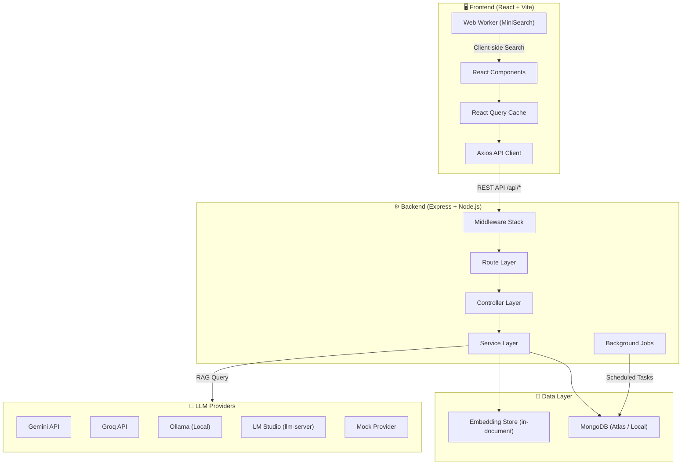

### System Architecture Diagram

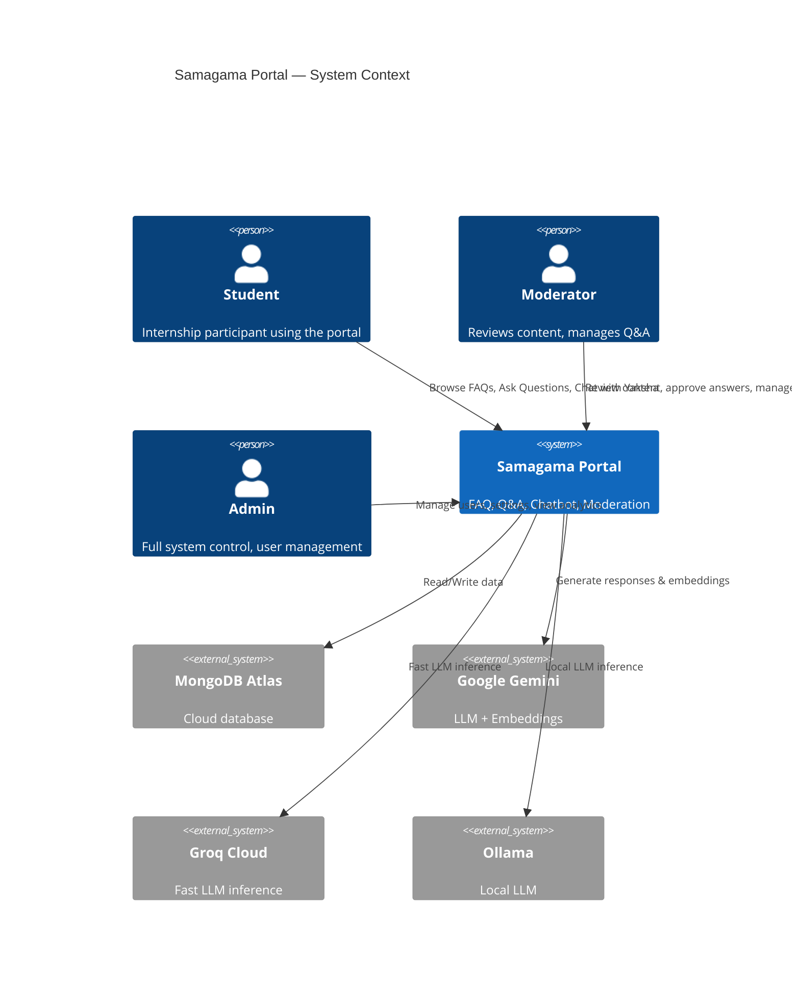

---

## 4. Folder & File Structure

```
samagama-portal/                  # Monorepo root
├── apps/
│   ├── client/                   # React frontend (Vite)
│   │   ├── src/
│   │   │   ├── App.tsx           # Top-level router with all routes
│   │   │   ├── main.tsx          # React entry point + providers
│   │   │   ├── components/ui/    # Reusable UI primitives (Button, Card, Modal, Toast, etc.)
│   │   │   ├── features/         # Feature-based modules (see §5)
│   │   │   │   ├── admin/        # Admin dashboard, FAQ management, user management
│   │   │   │   ├── analytics/    # Student analytics page
│   │   │   │   ├── auth/         # Login, AuthProvider, RequireAuth guard
│   │   │   │   ├── chatbot/      # Yaksha chatbot page
│   │   │   │   ├── faq/          # FAQ browsing, curated FAQs, FAQ cards
│   │   │   │   ├── flag/         # Content flagging dialogs
│   │   │   │   ├── moderation/   # Moderation queue, unresolved questions
│   │   │   │   ├── notifications/# Notification API and queries
│   │   │   │   ├── qna/          # Community Q&A: ask, browse, detail, my questions
│   │   │   │   ├── search/       # Unified search page
│   │   │   │   ├── stats/        # Stats API and idle bucket cards
│   │   │   │   └── theme/        # Dark/light theme provider
│   │   │   ├── hooks/            # Custom hooks (useExclusiveOpen, useSettings, useUnifiedSearch)
│   │   │   ├── layouts/          # AppShell, Sidebar, ChatbotFab, navigation config
│   │   │   ├── lib/              # API client (Axios), design tokens
│   │   │   ├── pages/            # Top-level pages (Home, InternshipOverview, NotFound)
│   │   │   ├── styles/           # Global CSS, Yaksha mini CSS
│   │   │   ├── test/             # Test setup
│   │   │   └── workers/          # Web Worker for MiniSearch
│   │   ├── index.html            # HTML entry point
│   │   ├── vite.config.ts        # Vite configuration
│   │   └── vitest.config.ts      # Vitest test configuration
│   │
│   ├── server/                   # Express API server
│   │   ├── src/
│   │   │   ├── index.ts          # Server entry point (boot DB, start listener, schedule jobs)
│   │   │   ├── app.ts            # Express app factory (middleware + routes)
│   │   │   ├── config/           # Environment (Zod-validated), database, logger
│   │   │   ├── controllers/      # Route handlers (thin — delegate to services)
│   │   │   ├── middlewares/      # Auth, validation, error handling
│   │   │   ├── models/           # Mongoose schemas and document types (16 models)
│   │   │   ├── routes/           # Express routers (1 per resource)
│   │   │   ├── services/         # Business logic layer (16 services)
│   │   │   ├── utils/            # API error class, JWT helpers, TTL cache, slugify
│   │   │   ├── jobs/             # Background jobs (analytics, embedding backfill, trash expiry)
│   │   │   ├── scripts/          # Seeding, simulation, and testing scripts
│   │   │   └── __tests__/        # API integration tests (Vitest + Supertest)
│   │   ├── package.json
│   │   └── vitest.config.ts
│   │
│   └── rag/                      # RAG / LLM subsystem
│       ├── llm-server/           # Standalone Express server proxying to LM Studio
│       │   ├── index.js          # LLM proxy: /internal/llm/generate & /internal/llm/summarize
│       │   └── package.json
│       ├── knowledge_base.md     # Programme knowledge base for RAG context
│       └── GEMINI.md             # Gemini integration notes
│
├── packages/
│   └── shared/                   # @samagama/shared — cross-cutting types, constants, schemas
│       └── src/
│           ├── index.ts          # Barrel export
│           ├── constants.ts      # JWT TTLs, pagination defaults, Spurti Points rules
│           ├── enums.ts          # Roles, statuses, question types, flag reasons
│           ├── types.ts          # API envelope types (ApiSuccess, ApiError, ApiMeta)
│           └── schemas/          # Zod schemas for auth, FAQ, Q&A, chatbot, etc.
│
├── docker-compose.yml            # Local dev: MongoDB + Server + Client containers
├── .env.example                  # Environment variable template
├── .github/workflows/ci.yml     # GitHub Actions CI pipeline
├── package.json                  # Root workspace orchestrator
├── tsconfig.base.json            # Shared TypeScript settings
└── eslint.config.js              # Monorepo ESLint config
```

---

## 5. Frontend Architecture

### 5.1 Provider Hierarchy

The app wraps React in a layered provider stack. The order matters:

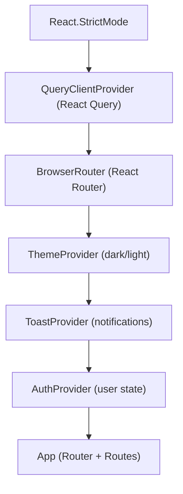

### 5.2 Feature Module Pattern

Each feature follows a consistent internal structure:

```
features/<name>/
├── <Name>Page.tsx       # Main page component
├── api.ts               # Raw Axios calls to the backend
├── queries.ts           # React Query hooks (useQuery, useMutation)
├── __tests__/           # Unit/component tests
└── <SubComponents>.tsx  # Feature-specific UI components
```

**Key features:**

| Feature | Responsibility |
|---------|---------------|
| `auth` | Login page, `AuthProvider` context, `RequireAuth` route guard |
| `faq` | FAQ browsing, curated public FAQs, FAQ cards with voting |
| `qna` | Community questions, ask question form, question detail with answers |
| `chatbot` | Yaksha AI chat interface, session management, feedback submission |
| `moderation` | Moderation queue, unresolved questions, FAQ candidates, analytics |
| `admin` | Admin overview, FAQ management (with inline editor), user management, settings |
| `flag` | Content flagging dialog for FAQs, questions, answers, chatbot responses |
| `search` | Unified full-text search across FAQs and Q&A |
| `analytics` | Student analytics dashboard |
| `notifications` | In-app notification bell integration |
| `stats` | Stats API hooks and idle bucket display cards |
| `theme` | Dark/light mode toggle provider |

### 5.3 Component Interaction Diagram

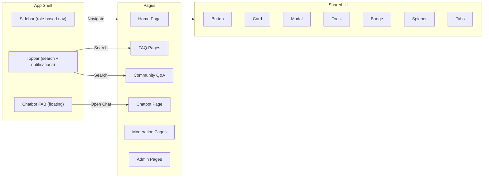

### 5.4 Routing Architecture

Routes are divided into three zones:

| Zone | Guard | Example Routes |
|------|-------|---------------|
| **Public** | None | `/login`, `/browse-faqs`, `/internship-overview` |
| **Student** | `RequireAuth` | `/`, `/faqs`, `/community`, `/ask`, `/my-questions`, `/analytics`, `/chatbot` |
| **Moderator** | `RequireAuth` + role sidebar | `/moderation`, `/moderation/unresolved`, `/admin/faqs`, `/admin/bot-feedback` |
| **Admin** | `RequireAuth` + role sidebar | `/admin`, `/admin/users`, `/admin/settings`, `/admin/faq-quality` |

> **Note:** Role-based access is enforced at two levels: the sidebar shows different navigation per role, and the backend enforces permissions on every API endpoint.

### 5.5 Design System

The frontend uses a **design-token-based system** defined in `lib/tokens.ts`:

- **Spacing:** 4px base grid (0–64px scale)
- **Typography:** Semantic scale (caption → 4xl), with preset bundles (pageTitle, sectionTitle, body, meta, eyebrow)
- **Radius:** xs(6) → full(9999) scale
- **Shadows:** sm, md, lg, hover via CSS variables
- **Colors:** CSS custom properties in `globals.css` with dark mode support via `ThemeProvider`

A complementary `yaksha-mini.css` provides chat-specific styles for the Yaksha chatbot bubble.

---

## 6. Backend Architecture

### 6.1 Layered Architecture

The server follows a strict **4-layer** architecture:

```mermaid
graph TB
    subgraph "Request Pipeline"
        A["Express Middleware Stack"]
        B["Route Layer"]
        C["Controller Layer"]
        D["Service Layer"]
        E["Model / Data Layer"]
    end

    A -->|"helmet, cors, json, cookie, morgan, rateLimit"| B
    B -->|"validate + requireAuth + requireRole"| C
    C -->|"parse req, call service, send response"| D
    D -->|"business logic, aggregation, side-effects"| E

    style A fill:#2d3436,stroke:#636e72,color:#dfe6e9
    style B fill:#2d3436,stroke:#636e72,color:#dfe6e9
    style C fill:#2d3436,stroke:#636e72,color:#dfe6e9
    style D fill:#2d3436,stroke:#636e72,color:#dfe6e9
    style E fill:#2d3436,stroke:#636e72,color:#dfe6e9
```

| Layer | Responsibility | Rule |
|-------|---------------|------|
| **Middleware** | Cross-cutting concerns: auth, validation, rate limiting, error handling | No business logic |
| **Routes** | HTTP verb + path + middleware chain wiring | Declarative only — no logic |
| **Controllers** | Parse request, call service, format response | Thin — no DB calls |
| **Services** | All business logic, data access, side effects | No Express types (pure TS) |
| **Models** | Mongoose schemas, indexes, hooks, virtuals, statics | Data shape + constraints |

### 6.2 Middleware Pipeline

Requests flow through this middleware chain (defined in `app.ts`):

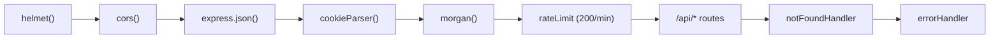

### 6.3 Route Registry

All API routes mount under `/api`:

| Path | Router | Auth Required | Description |
|------|--------|--------------|-------------|
| `/api/health` | inline | No | Liveness probe (load balancer / uptime checks) |
| `/api/auth` | `auth.routes` | Partial | Register, login, refresh, logout, me |
| `/api/faqs` | `faq.routes` | Partial | CRUD, search, vote, recently viewed |
| `/api/qna` | `qna.routes` | Yes | Questions, answers, votes, duplicate check |
| `/api/categories` | `category.routes` | Yes (admin) | Category CRUD |
| `/api/tags` | `tag.routes` | Yes (admin) | Tag CRUD |
| `/api/moderation` | `moderation.routes` | Yes (mod+) | Queue, approve/reject, convert to FAQ |
| `/api/flags` | `flag.routes` | Yes | Report content, review flags |
| `/api/chat` | `chatbot.routes` | Yes | Chat with Yaksha, submit feedback |
| `/api/stats` | `stats.routes` | Partial | Dashboard statistics and analytics |
| `/api/users` | `user.routes` | Yes (admin) | User management |
| `/api/admin` | `admin.routes` | Yes (admin) | Admin operations |
| `/api/audit-logs` | `audit.routes` | Yes (admin) | Audit trail viewer |
| `/api/settings` | `settings.routes` | Yes (admin) | System settings |
| `/api/notifications` | `notification.routes` | Yes | Bell feed, mark read |
| `/api/help-data` | `help.routes` | No | Public help/programme data |

### 6.4 Service Layer Overview

| Service | Lines | Key Responsibilities |
|---------|-------|---------------------|
| `auth.service` | Auth business logic: register (bcrypt), login, refresh, profile |
| `faq.service` | FAQ CRUD, publishing, voting (helpful/unhelpful), search, recently viewed |
| `qna.service` | Question CRUD, answer submission, voting, duplicate detection, status transitions |
| `chatbot.service` | RAG orchestration, session management, escalation, feedback |
| `moderation.service` | Review queue, approve/reject answers, convert answers to FAQs, priority scoring |
| `analytics.service` | Dashboard stats aggregation, quality score recomputation, trend analysis |
| `stats.service` | Complex aggregations for admin/moderator dashboards |
| `embedding.service` | 384-dim vector generation (multi-provider), cosine similarity |
| `flag.service` | Content flagging lifecycle (create, review, resolve, dismiss) |
| `user.service` | User management, role assignment, suspension, Spurti Points |
| `notification.service` | In-app notification creation and delivery |
| `audit.service` | Audit log recording for admin/moderator actions |
| `category.service` | Category CRUD with slug auto-generation |
| `tag.service` | Tag CRUD with slug auto-generation |
| `settings.service` | System settings singleton read/update |
| `help.service` | Public help data aggregation |

### 6.5 Background Jobs

Three scheduled jobs run after server startup:

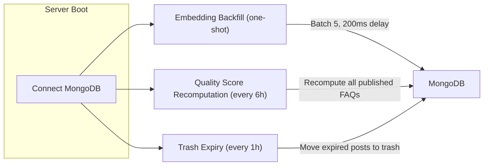

| Job | Schedule | Description |
|-----|----------|-------------|
| **Embedding Backfill** | Once at startup | Generates 384-dim embeddings for FAQs/Questions missing them |
| **Quality Score Recomputation** | Every 6 hours | Recalculates composite quality scores for all published FAQs |
| **Trash Expiry** | Every 1 hour | Moves community questions past their visibility window to trash |

---

## 7. Database Design & Relationships

### 7.1 Entity-Relationship Diagram

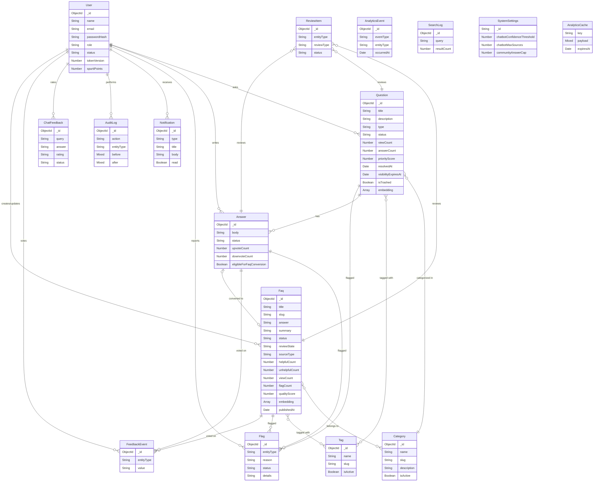

### 7.2 Collection Details

| Collection | Records | TTL | Key Indexes |
|-----------|---------|-----|-------------|
| **User** | Persistent | — | `email` (unique), `role+status` (compound) |
| **Faq** | Persistent | — | `slug` (unique), `status+updatedAt`, `status+qualityScore`, text index on `title+summary+answer` |
| **Question** | Persistent | — | `category`, `status+type+updatedAt`, `status+priorityScore`, text index on `title+description` |
| **Answer** | Persistent | — | `questionId+status+upvoteCount`, `questionId+answeredBy` (unique compound) |
| **Category** | Persistent | — | `slug` (unique), `isActive` |
| **Tag** | Persistent | — | `slug` (unique), `isActive` |
| **Flag** | Persistent | — | `entityType+entityId`, partial unique on `reportedBy+entityType+entityId+status` |
| **Notification** | Persistent | — | `userId+createdAt`, `userId+read` |
| **AuditLog** | Persistent | — | `entityType+entityId`, `createdAt` |
| **ChatFeedback** | Persistent | — | `rating+createdAt`, `userId` |
| **ReviewItem** | Persistent | — | `entityType+entityId`, `status+reviewType+createdAt` |
| **AnalyticsEvent** | Auto-purge | 730 days (2 years) | `eventType`, `occurredAt` (TTL) |
| **FeedbackEvent** | Persistent | — | `userId+entityType+entityId` (unique), `entityType+entityId` |
| **SearchLog** | Auto-purge | 365 days (1 year) | `searchedAt` (TTL), `normalizedQuery+resultCount` |
| **SystemSettings** | Singleton | — | `_id: 'global'` |
| **AnalyticsCache** | Auto-purge | Variable | `key` (unique), `expiresAt` (TTL) |

---

## 8. API Architecture and Request Flow

### 8.1 Request Lifecycle Diagram

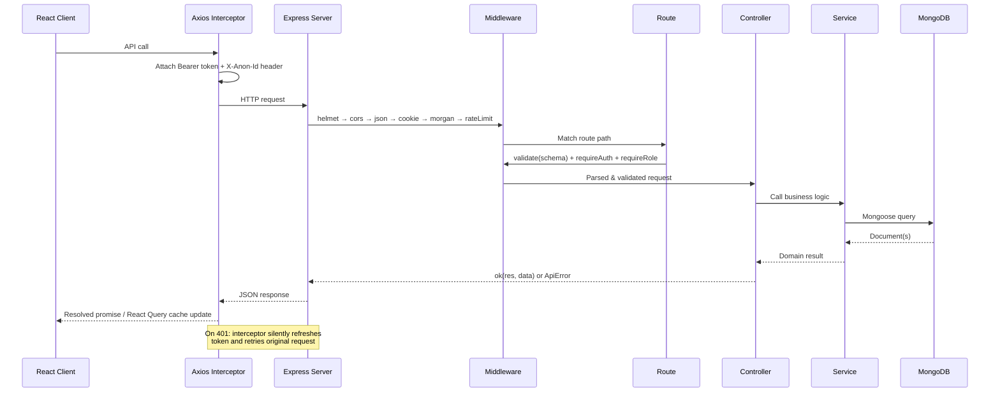

### 8.2 Response Envelope

All API responses follow a uniform JSON envelope:

**Success:**
```json
{
  "success": true,
  "data": { /* payload */ },
  "meta": { "page": 1, "pageSize": 20, "total": 42, "totalPages": 3 }
}
```

**Error:**
```json
{
  "success": false,
  "error": {
    "code": "VALIDATION_ERROR",
    "message": "Request validation failed",
    "details": [{ "path": "email", "message": "Invalid email" }]
  }
}
```

### 8.3 Data Flow Diagram

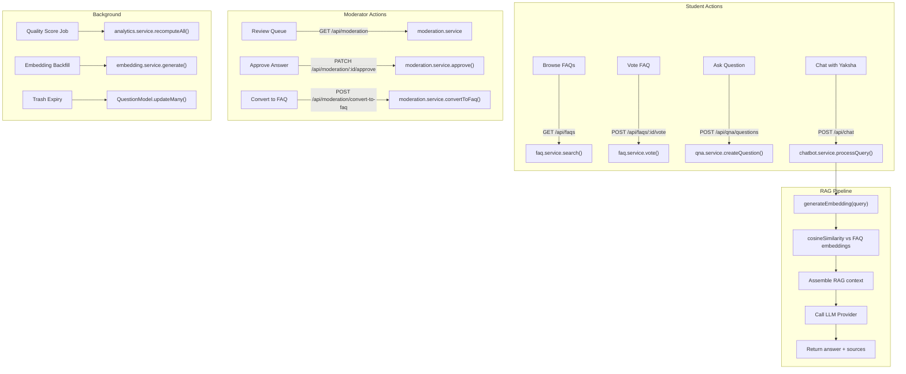

---

## 9. Authentication & Authorization Flow

### 9.1 Authentication Flow Diagram

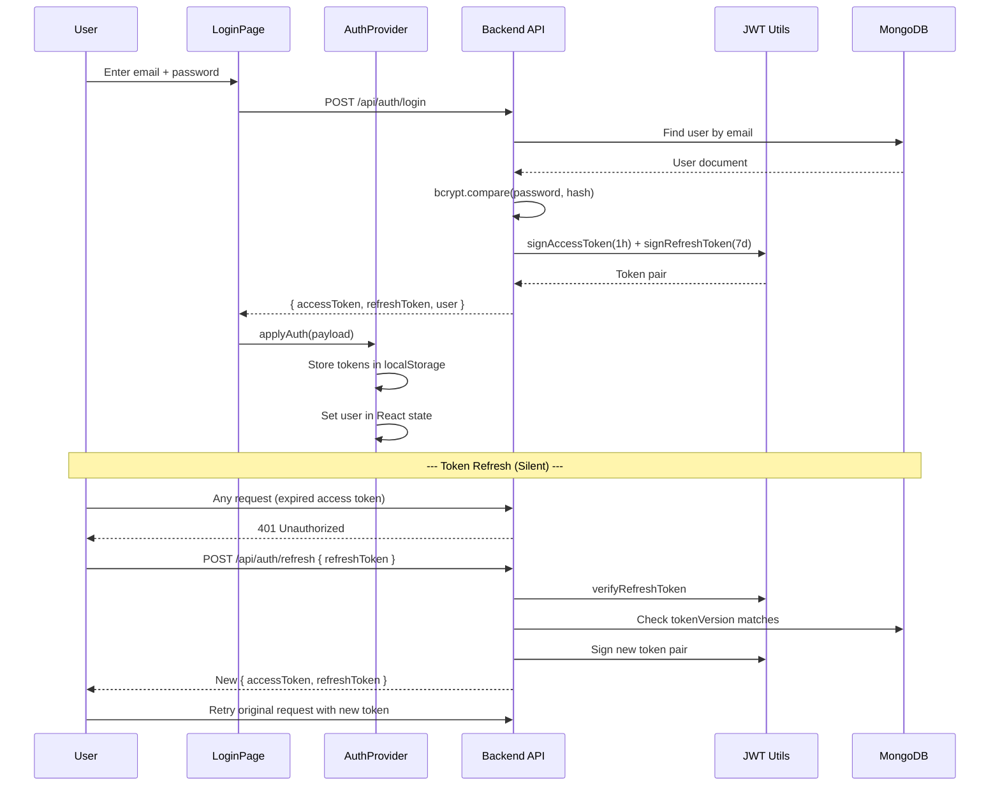

### 9.2 Token Architecture

| Token | Secret | TTL | Storage | Contains |
|-------|--------|-----|---------|----------|
| **Access Token** | `JWT_ACCESS_SECRET` | 1 hour | `localStorage` | `sub` (userId), `role`, `type: 'access'` |
| **Refresh Token** | `JWT_REFRESH_SECRET` | 7 days | `localStorage` | `sub` (userId), `ver` (tokenVersion), `type: 'refresh'` |

**Key security features:**
- Separate secrets for access and refresh tokens
- `tokenVersion` on the User model — bumped on password change to invalidate all refresh tokens
- Axios interceptor queues concurrent requests during refresh to avoid race conditions
- Silent refresh — users never see a login prompt within the 7-day window

### 9.3 Role-Based Access Control (RBAC)

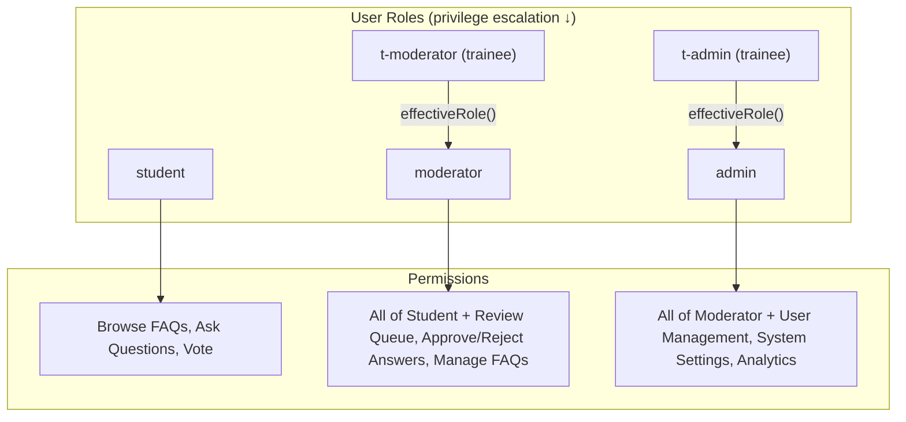

**Authorization middleware stack:**

| Middleware | Purpose |
|-----------|---------|
| `requireAuth` | Verifies the Bearer access token and populates `req.user` |
| `optionalAuth` | Best-effort auth — populates `req.user` if valid token present, continues anonymously otherwise |
| `requireRole(...roles)` | Checks `effectiveRole(req.user.role)` against allowed roles |
| `requireOwnerOrRole(getOwnerId, ...roles)` | Allows access if user owns the resource OR has the required role |

> **Trainee roles** (`t-moderator`, `t-admin`) have FULL access of their shadowed role. The `effectiveRole()` function collapses them: `t-moderator → moderator`, `t-admin → admin`.

---

## 10. Key Features and Functionalities

### 10.1 FAQ Knowledge Base

- **Full-text search** with weighted fields (title: 10x, summary: 5x, answer: 1x)
- **Semantic search** via 384-dim embeddings and cosine similarity
- **Client-side search** using MiniSearch in a Web Worker (offline-capable, instant results)
- **Helpful/Unhelpful voting** with anonymous voter support (X-Anon-Id header)
- **Category and Tag filtering** with multi-select support
- **Quality Score** (0–100 composite: 35% helpfulness, 25% view traction, 20% freshness, 10% low flags, 10% mod-reviewed)
- **Status lifecycle:** Draft → Published → Outdated
- **Public curated FAQ page** at `/browse-faqs` (no login required)

### 10.2 Community Q&A

- **Question types:** `personal` (visible only to moderators) and `community` (public)
- **Answer moderation:** All answers start as `pending` → moderator approves/rejects/requests changes
- **Upvote/Downvote** on answers with Spurti Points rewards
- **Duplicate detection** via embedding similarity + text search
- **Existing Answer Check** on question submission — shows matching FAQs/questions before posting
- **Visibility expiry** — moderators set a time window (2/3/7 days), after which the question is auto-trashed
- **FAQ conversion** — approved community answers can be promoted into the FAQ knowledge base
- **Answer cap** — configurable max answers per question (default: 10)

### 10.3 Yaksha RAG Chatbot

- **Multi-provider LLM:** Gemini, Groq, Ollama, LM Studio, Mock
- **RAG pipeline:** Query embedding → cosine similarity search → FAQ context assembly → LLM generation
- **Session management** via in-process TTL cache (30-minute idle timeout, 500 max sessions)
- **Fallback behavior:** When no relevant FAQ matches, Yaksha suggests `#escalate`
- **Escalation commands:** `#escalate` (after fallback) and `#forceescalate` (anytime)
- **Feedback collection:** Students rate responses as helpful/incorrect
- **Configurable thresholds:** Confidence threshold and max sources via SystemSettings

### 10.4 Moderation System

- **Unresolved question queue** with priority scoring
- **Moderator "Seen" tick** — WhatsApp-style status for personal questions (posted → seen → responded)
- **FAQ candidates page** — surfaces answers eligible for FAQ conversion
- **Review items** — structured workflow for flagged content, quality issues, and duplicate checks
- **Moderator analytics** — workload metrics and response time tracking
- **Audit trail** — every moderator/admin action is logged with before/after snapshots

### 10.5 Admin Panel

- **Admin Overview** — aggregate dashboard with key metrics
- **User Management** — CRUD, role assignment (including trainee roles), suspension, deletion
- **FAQ Management** — inline editor, bulk operations, category/tag management (tabbed UI)
- **Chatbot Feedback** — review student ratings, archive handled items
- **FAQ Quality** — quality score distribution and low-quality FAQ identification
- **Moderation Load** — workload distribution across moderators
- **System Settings** — configure chatbot thresholds, answer caps, urgency timers

### 10.6 Gamification (Spurti Points)

| Action | Points |
|--------|--------|
| New student registration | +100 (initial balance) |
| Answer approved by moderator | +5 |
| Upvote received on approved answer | +5 |

### 10.7 Notifications

- In-app bell notifications for:
  - Answer approved/rejected
  - Question answered
  - Flag reviewed
  - General announcements
- Unread count badge
- Mark individual or all as read

---

## 11. Third-Party Integrations

### 11.1 LLM Providers

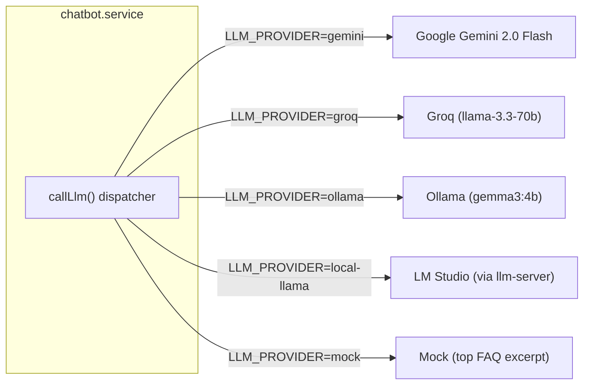

| Provider | API Key Required | Cost | Latency | Notes |
|----------|-----------------|------|---------|-------|
| **Gemini** | Yes (`GEMINI_API_KEY`) | Free tier available | ~1-2s | Also provides embeddings |
| **Groq** | Yes (`GROQ_API_KEY`) | Free tier: 14,400 req/day | ~200-500ms | Fastest inference |
| **Ollama** | No | Free (local) | ~2-5s | Requires local install |
| **LM Studio** | Shared secret | Free (local) | ~2-5s | Via `apps/rag/llm-server` proxy |
| **Mock** | No | Free | Instant | Returns top FAQ answer verbatim |

### 11.2 Embedding Providers

| Provider | Model | Dimensions | API Key |
|----------|-------|-----------|---------|
| **Gemini** | `gemini-embedding-001` | 384 (truncated) | `GEMINI_API_KEY` |
| **Ollama** | `all-minilm` (all-MiniLM-L6-v2) | 384 (native) | None |
| **Mock** | Character hash | 384 | None |

### 11.3 MongoDB Atlas

- Cloud-hosted document database
- Connection via `MONGODB_URI` environment variable
- Supports both Atlas cloud and local MongoDB instances
- TTL indexes for automatic data cleanup (analytics events, search logs, cache)

---

## 12. Environment Variables & Configuration

Environment configuration is **Zod-validated** at startup — the server exits immediately if required variables are missing or malformed.

| Variable | Required | Default | Description |
|----------|----------|---------|-------------|
| `NODE_ENV` | No | `development` | `development` / `test` / `production` |
| `PORT` | No | `4000` | Server listen port |
| `MONGODB_URI` | **Yes** | — | MongoDB connection string |
| `JWT_ACCESS_SECRET` | **Yes** | — | ≥32 chars, signs access tokens |
| `JWT_REFRESH_SECRET` | **Yes** | — | ≥32 chars, signs refresh tokens (must differ from access secret) |
| `CORS_ORIGINS` | No | `http://localhost:5173` | Comma-separated allowed origins |
| `LOG_LEVEL` | No | `info` | Pino log level |
| `LLM_PROVIDER` | No | `mock` | `mock` / `gemini` / `ollama` / `groq` / `local-llama` |
| `EMBEDDING_PROVIDER` | No | `mock` | `mock` / `gemini` / `ollama` |
| `GEMINI_API_KEY` | Conditional | — | Required when provider is `gemini` |
| `GROQ_API_KEY` | Conditional | — | Required when provider is `groq` |
| `GROQ_MODEL` | No | `llama-3.3-70b-versatile` | Groq model selection |
| `OLLAMA_BASE_URL` | No | `http://localhost:11434` | Ollama server URL |
| `OLLAMA_MODEL` | No | `gemma3:4b` | Ollama chat model |
| `LLM_BASE_URL` | Conditional | — | LM Studio proxy URL |
| `LLM_INTERNAL_SECRET` | Conditional | — | Shared secret with llm-server |

**Client-side variables** (prefixed `VITE_`):

| Variable | Default | Description |
|----------|---------|-------------|
| `VITE_API_URL` | `''` (same origin) | Backend API base URL |

---

## 13. Deployment Architecture

### 13.1 Docker Compose (Local Development)

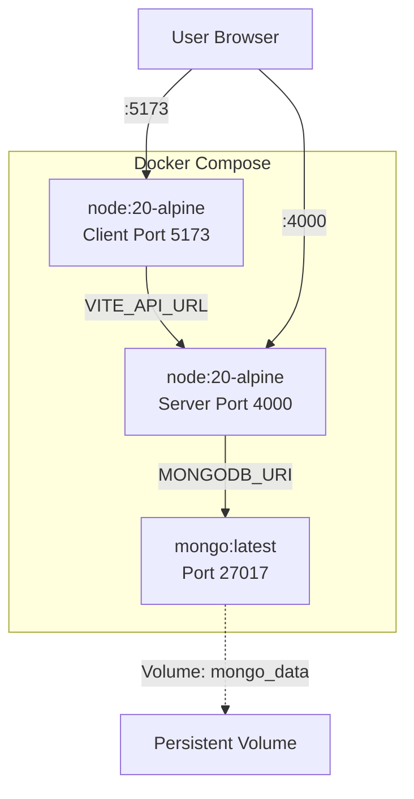

**Container startup order:**
1. `mongo` — starts with a health check (`mongosh --eval "db.adminCommand('ping')"`)
2. `server` — waits for healthy mongo, runs `npm ci && npm run build:server && node dist/index.js`
3. `client` — waits for server, runs `npm ci && npm run build:client && vite preview`

### 13.2 Production Deployment

For production, the recommended architecture:

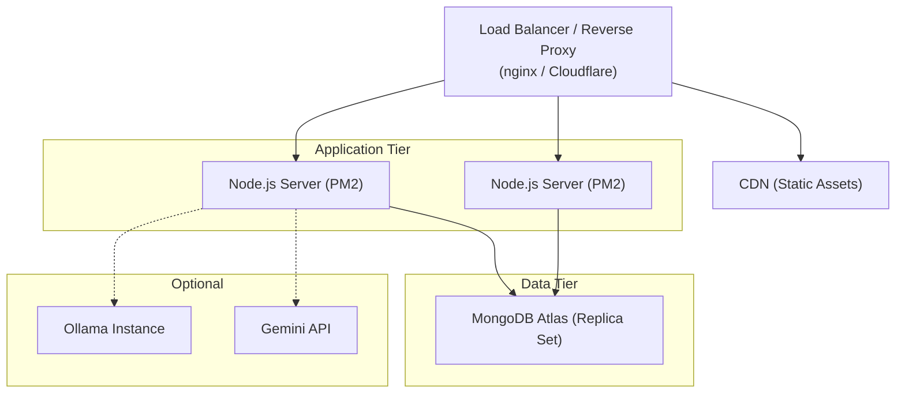

### 13.3 CI/CD Pipeline

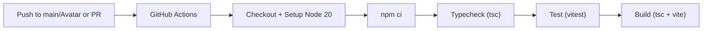

The CI pipeline runs on every push to `main`/`Avatar` and on pull requests. It uses mock LLM/embedding providers and a test MongoDB URI.

---

## 14. Error Handling & Logging Strategy

### 14.1 Error Handling Pipeline

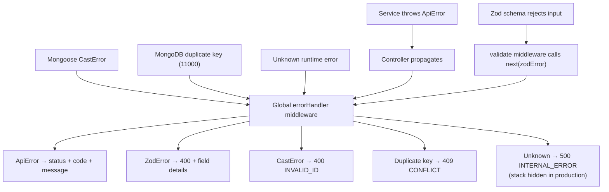

**Error codes:**

| Code | HTTP Status | Description |
|------|-------------|-------------|
| `BAD_REQUEST` | 400 | Malformed request |
| `VALIDATION_ERROR` | 400 | Schema validation failed (Zod or Mongoose) |
| `INVALID_ID` | 400 | Invalid ObjectId format |
| `UNAUTHORIZED` | 401 | Missing or expired authentication |
| `FORBIDDEN` | 403 | Insufficient role/ownership permissions |
| `NOT_FOUND` | 404 | Resource or route not found |
| `CONFLICT` | 409 | Duplicate key violation |
| `UNPROCESSABLE_ENTITY` | 422 | Semantically invalid request |
| `INTERNAL_ERROR` | 500 | Unhandled server error (details hidden in prod) |

### 14.2 Logging Strategy

| Layer | Tool | Format | Details |
|-------|------|--------|---------|
| **Server** | Pino | JSON (prod) / Pretty (dev) | Structured, with field redaction |
| **HTTP Requests** | Morgan | `combined` (prod) / `dev` (dev) | Standard Apache log format |
| **Client** | Browser console | — | Errors surface via React Query |

**Pino redaction paths** (sensitive data never logged):
- `req.headers.authorization`
- `req.headers.cookie`
- `*.password`
- `*.passwordHash`

---

## 15. Security Considerations

### 15.1 Authentication Security

| Measure | Implementation |
|---------|---------------|
| **Password hashing** | bcrypt with 12 rounds |
| **Separate JWT secrets** | Access and refresh tokens use different secrets |
| **Token versioning** | `tokenVersion` on User — bumped on password change to revoke all sessions |
| **Credential error obfuscation** | Same "Invalid credentials" error for wrong email AND wrong password |
| **Suspended account blocking** | Suspended users cannot login or re-register |
| **Login rate limiting** | 10 attempts per 15 minutes per IP (production only) |

### 15.2 HTTP Security

| Measure | Implementation |
|---------|---------------|
| **Helmet** | Sets secure HTTP headers (CSP, HSTS, X-Frame-Options, etc.) |
| **CORS** | Explicit origin whitelist with credentials support |
| **Rate limiting** | Global: 200 req/min per IP; Login: 10/15min |
| **`x-powered-by` disabled** | Hides Express fingerprint |
| **Body size limit** | 10 MB max for JSON/URL-encoded payloads |

### 15.3 Data Security

| Measure | Implementation |
|---------|---------------|
| **Input validation** | Zod schemas validate every request body/query/params |
| **MongoDB strict query** | `strictQuery: true` rejects unknown query fields |
| **Credential redaction** | Connection URIs are redacted before logging |
| **Secret length enforcement** | JWT secrets must be ≥32 characters (Zod-validated at boot) |
| **No plaintext passwords** | Only bcrypt hashes are stored |
| **Anonymous voter tracking** | `X-Anon-Id` header for anonymous voting — ObjectId-shaped, no PII |

### 15.4 Authorization Security

| Measure | Implementation |
|---------|---------------|
| **Defense in depth** | Role checks at both frontend (sidebar visibility) and backend (middleware) |
| **Ownership checks** | `requireOwnerOrRole()` middleware for resource-level authorization |
| **One vote per entity** | Unique compound indexes prevent double-voting |
| **One flag per entity** | Partial unique index on `(reportedBy, entityType, entityId)` for active flags |
| **Admin-only role assignment** | Only admins can assign roles during registration |

---

## 16. Performance Optimizations

### 16.1 Database

| Optimization | Description |
|-------------|-------------|
| **Compound indexes** | Targeted indexes for common query patterns (e.g., `status+qualityScore`, `status+priorityScore`) |
| **Text indexes** | Weighted text search on FAQ (title 10x, summary 5x, answer 1x) |
| **TTL indexes** | Auto-purge of analytics events (2yr), search logs (1yr), and cache entries |
| **Selective field projection** | Embedding arrays are `select: false` — never loaded unless explicitly requested |
| **Lean queries** | `.lean()` used for read-only queries (skips Mongoose document overhead) |
| **Denormalized counts** | `helpfulCount`, `unhelpfulCount`, `upvoteCount`, `downvoteCount` are maintained alongside vote arrays for cheap reads |

### 16.2 Server

| Optimization | Description |
|-------------|-------------|
| **In-memory TTL cache** | Session data and hot query results cached in-process (no Redis dependency) |
| **Analytics cache** | Pre-computed aggregations stored in `AnalyticsCache` with TTL |
| **Lazy eviction** | TTL cache evicts expired entries on read; bulk evicts oldest 10% on overflow |
| **Batched embedding backfill** | Processes 5 documents at a time with 200ms delay to avoid API rate limits |
| **Fire-and-forget jobs** | Background jobs never block server startup or request handling |
| **Graceful shutdown** | Drains connections, disconnects DB, with 10s force-exit timeout |

### 16.3 Frontend

| Optimization | Description |
|-------------|-------------|
| **React Query stale time** | 30-second default — avoids redundant refetches during navigation |
| **Single retry** | Failed queries retry once (not the default 3) to reduce timeout delays |
| **No refetch on focus** | Prevents unnecessary API calls when switching browser tabs |
| **Web Worker search** | MiniSearch runs in a dedicated Web Worker (non-blocking UI thread) |
| **Lazy routing** | Route-based code splitting via React Router's nested layout pattern |
| **Token queue** | Concurrent 401 requests are queued during refresh — only one refresh call is made |
| **Anonymous ID caching** | Stable `X-Anon-Id` is generated once and persisted in localStorage |

---

## 17. Development Workflow

### 17.1 Getting Started

```bash
# 1. Clone and install
git clone <repo-url>
cd samagama-portal
cp .env.example .env          # Fill in real values
npm install                    # Installs all workspaces

# 2. Start development
npm run dev                    # Starts server (port 4000) + client (port 5173) concurrently

# Or start individually:
npm run dev:server             # Express server with tsx watch (hot reload)
npm run dev:client             # Vite dev server with HMR

# 3. Seed data (optional)
npm run seed:accounts --workspace @samagama/server
npm run seed:faqs --workspace @samagama/server
npm run seed:interactions --workspace @samagama/server
```

### 17.2 Available Scripts

| Script | Scope | Description |
|--------|-------|-------------|
| `npm run dev` | Root | Start both server and client |
| `npm run build` | Root | Build all workspaces |
| `npm run lint` | Root | ESLint across all workspaces |
| `npm run format` | Root | Prettier format all files |
| `npm run test` | Root | Run all workspace tests |
| `npm run typecheck` | Root | TypeScript type checking |
| `npm run seed:accounts` | Server | Seed user accounts |
| `npm run seed:faqs` | Server | Seed FAQ data |
| `npm run seed:interactions` | Server | Seed Q&A, votes, and analytics data |
| `npm run simulate:full` | Server | Full simulation of student activity |

### 17.3 Testing Strategy

| Test Type | Tool | Location | Focus |
|-----------|------|----------|-------|
| **Unit Tests** | Vitest | `*/__tests__/*.test.ts` | Services, utilities, shared schemas |
| **Component Tests** | Vitest + Testing Library | `features/*/__tests__/*.test.tsx` | React component behavior |
| **API Tests** | Vitest + Supertest | `server/src/__tests__/*.test.ts` | Endpoint integration (health, role access) |
| **Search Accuracy** | Custom scripts | `server/src/scripts/test-search-accuracy.ts` | Search relevance benchmarking |

### 17.4 Code Quality

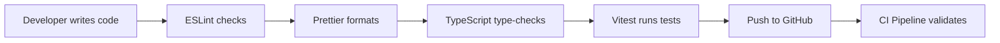

---

## 18. Architectural Decisions & Assumptions

### 18.1 Key Decisions

| Decision | Rationale |
|----------|-----------|
| **Monorepo with npm workspaces** | Enables shared types/schemas across client and server; atomic PRs; single `npm install` |
| **In-process TTL cache instead of Redis** | Single-process MVP — avoids operational complexity; swap-friendly via `TtlCache` interface |
| **384-dim embeddings** | Matches all-MiniLM-L6-v2 native output; Gemini truncated to match; consistent validation |
| **Pluggable LLM providers** | Team members can use Gemini (cloud), Ollama (free local), Groq (fast free tier), or mock (offline) |
| **Denormalized vote counts** | Vote arrays are the source of truth; counts are sync'd for O(1) reads on list pages |
| **Zod schemas in `@samagama/shared`** | Single source of truth — same schema validates client forms, API requests, and Mongoose input |
| **Express app factory pattern** | `createApp()` returns app without listening — enables Supertest integration tests |
| **Token-version revocation** | Simpler than a blacklist; changing a password bumps `tokenVersion` to invalidate all refresh tokens |
| **TTL indexes for cleanup** | AnalyticsEvents (2yr), SearchLogs (1yr), and AnalyticsCache auto-purge without cron jobs |

### 18.2 Assumptions

- The portal serves a **single internship programme** (no multi-tenancy).
- Student volume is expected to be in the **hundreds, not millions** — in-memory caches are sufficient.
- The **LM Studio llm-server** is a development/testing tool, not a production recommendation.
- MongoDB Atlas handles **backups, replication, and scaling** in production.
- The Yaksha chatbot answers **ONLY from verified FAQ content** — it never generates unsourced information.

---

## 19. Recommendations for Future Improvements

### 19.1 Near-Term

| Area | Recommendation |
|------|---------------|
| **Real-time notifications** | Add WebSocket (Socket.IO) for push notifications instead of polling |
| **Image uploads** | Integrate cloud storage (S3/GCS) for question screenshots and avatar uploads |
| **Password reset** | Implement email-based password reset flow |
| **Audit log UI** | Build a filterable audit log viewer page for admins |
| **Rate limit persistence** | Use Redis-backed rate limiter for multi-process deployments |

### 19.2 Medium-Term

| Area | Recommendation |
|------|---------------|
| **MongoDB Atlas Vector Search** | Replace in-memory cosine similarity with Atlas `$vectorSearch` for scalability |
| **Redis session cache** | Move chatbot sessions to Redis for horizontal scaling |
| **SSR / SSG** | Consider Next.js for the public FAQ pages to improve SEO and initial load time |
| **Internationalization (i18n)** | Add multi-language support for the portal UI |
| **Email notifications** | Integrate an email service (SendGrid/SES) for important updates |

### 19.3 Long-Term

| Area | Recommendation |
|------|---------------|
| **Microservices extraction** | Split the chatbot/RAG service into a separate deployable |
| **Event-driven architecture** | Use message queues (RabbitMQ/SQS) for async operations (notifications, analytics) |
| **Full observability** | Add OpenTelemetry tracing, Prometheus metrics, and Grafana dashboards |
| **Multi-tenancy** | Support multiple internship programmes within a single deployment |
| **Mobile app** | React Native client reusing shared types and API layer |

---

> **This document is a living reference.** Update it as the architecture evolves.  
> Last generated: June 2026
